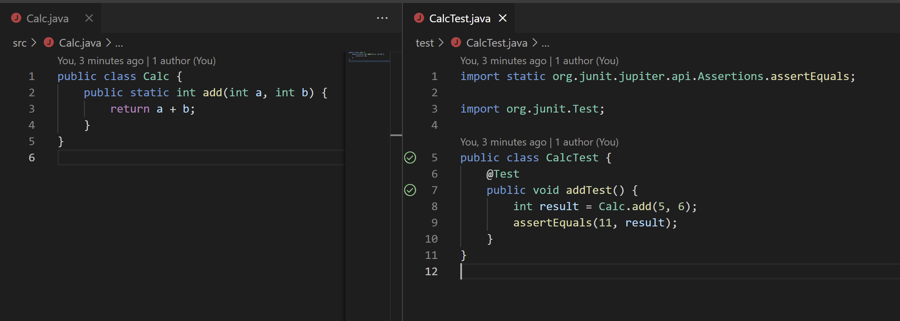

## Introduction

I installed the [Extension Pack for Java](https://marketplace.visualstudio.com/items?itemName=vscjava.vscode-java-pack),
then I created a simple java project in vscode by doing:

`ctrl` + `shift` + `p`

I selected: `Java: Create Java Project...`

Then I selected: `No build tools`

This gives you buttons on the side to run tests. The buttons show a green check mark after running
if the tests passed.

